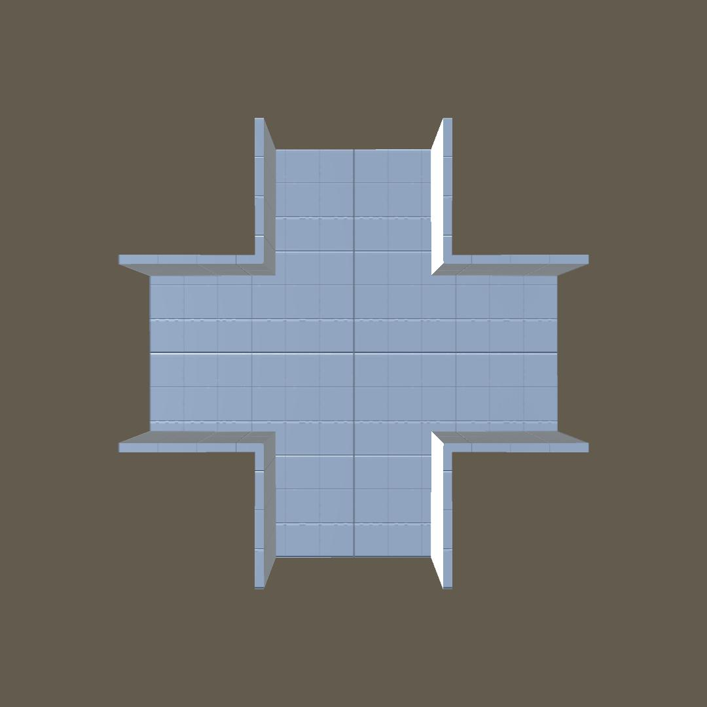

# Setting Up Your Own Prefabs

So, you want to add your own prefabs to the maze? Here's a step-by-step guide:

## Table of Contents
- [Setting Up Your Own Prefabs](#setting-up-your-own-prefabs)
  - [Table of Contents](#table-of-contents)
  - [Step 1: Get modular maze parts](#step-1-get-modular-maze-parts)
  - [Step 2: Converting the Meshes to prefab](#step-2-converting-the-meshes-to-prefab)
    - [Important Note: Rotate the prefabs correctly](#important-note-rotate-the-prefabs-correctly)

## Step 1: Get modular maze parts
  
  In order to generate a prefab maze, first you need to have to have at least one pre-built prefab for each scenario. 
  
  So either pick up your chosen 3D modelling software or buy a modular maze pack from the asset store. In this example I'll be using the standard pieces that come with this asset.

  By scenario, we're talking about how many paths a [Cell](../scripting_reference/cell.md) can have to its neighbouring cells and each unique pattern it creates. In the case of a [Quad Maze](./../scripting_reference/quad_maze_class.md) there are 5 unique scenarios possible:

|                                                |                                                   |
| :--------------------------------------------- | :------------------------------------------------ |
| Dead End      | Corner             |
| T-Section | Crossroads |
| Corridor    |

## Step 2: Converting the Meshes to prefab
   Now that you have the basic mesh pieces it's time to convert them into prefabs (if you're using an asset from the asset store, chances are the pieces are already in a prefab somewhere):
   * First import your mesh file (.fbx, .obj, .blend, etc...) into the project by dragging the file into the editor.
   * Next drag the piece you're converting to a prefab into the scene, it will create a game object with the piece name.
   * Right click the object and select **unpack completely**.
   * Since these are game objects, you can add colliders, scripts for game logic, visual props as a child of this object, enemy or item spawns and even make some duplicates with small differences to make your maze more diverse and less boring.
   * Finally drag the object to the Project window.
    
### Important Note: Rotate the prefabs correctly
  It's important that the prefabs are rotated in a certain way, the value of the base Y rotation is not important but the paths must be like the images with the first path starting in the **Z+ axis** and each next path going in a **clock wise** direction like the images above are laid out:

  

  Not doing so will result in some glitches when generating the maze like so:

  

    